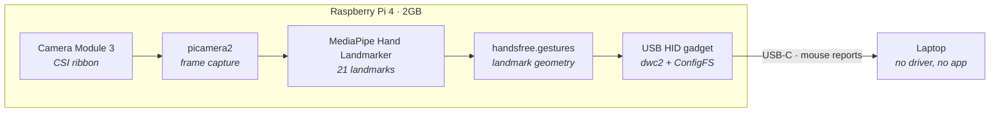
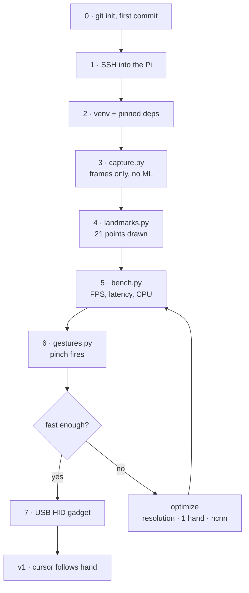

# Architecture

| | |
| --- | --- |
| Hardware | Pi 4 (2GB), Camera Module 3 |
| Capture | picamera2 |
| Inference | MediaPipe Hand Landmarker + `hand_landmarker.task` |
| Gestures | numpy geometry over landmarks |
| Output | Linux USB HID gadget |

# Implementation flow

Start at the Pi, not the code — the Python environment is what broke the
official sample, and everything else depends on it.
